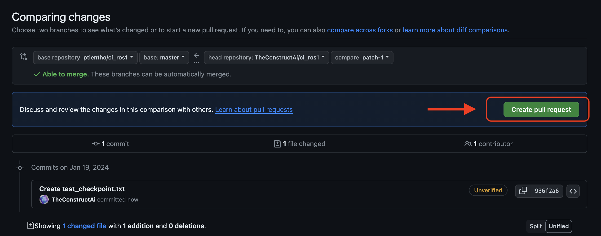

# tortoisebot ros2 ci

- [tortoisebot ros2 ci](#tortoisebot-ros2-ci)
  - [Run automation automatically](#run-automation-automatically)
    - [DEMO](#demo)
  - [Test docker part manually](#test-docker-part-manually)
  - [Commands for running Jenkins manually](#commands-for-running-jenkins-manually)

-------------------------------------------------

## Run automation automatically
### DEMO
<video controls>
  <source src="pictures/ros2-demo.mp4" type="video/mp4">
</video>

[To understand the usage, please review the Video](pictures/ros2-demo.mp4)

Also you can create a Pull Request


-------------------------------------------------

## Test docker part manually
run **docker compose**
```
cd ros2_ws/src/ros2_ci/
docker-compose -f docker-compose-sim2.yml up --build
```
if you want to execute another thing
```
sudo docker exec -it waypoints_container /bin/bash
```

-------------------------------------------------

## Commands for running Jenkins manually
for checking the available jenkins commands 
```
java -jar jenkins-cli.jar -s http://localhost:8080/$SLOT_PREFIX/jenkins/ -auth @.jenkins_cli help
```
for **running** and checking the log, use jenkins CLI
```
java -jar jenkins-cli.jar -s http://localhost:8080/$SLOT_PREFIX/jenkins/ -auth @.jenkins_cli build ros2_auto -f -s -v
```
for **aborting** the jenkins work
```
java -jar jenkins-cli.jar -s http://localhost:8080/$SLOT_PREFIX/jenkins/ -auth @.jenkins_cli stop-builds ros2_auto
```
for maintaining clean the works history
```
java -jar jenkins-cli.jar -s http://localhost:8080/$SLOT_PREFIX/jenkins/ -auth @.jenkins_cli delete-builds ros2_auto <buildNumber>
```

